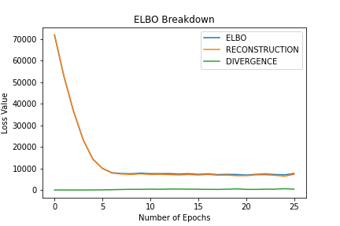
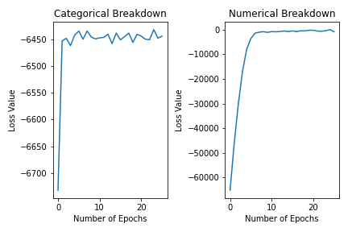
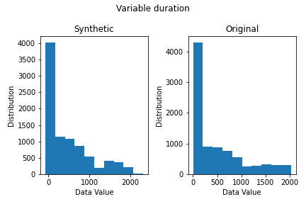
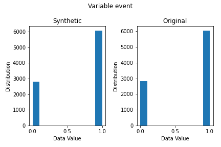

# Synthetic Data Exploration: Variational Autoencoders
## NHSX Analytics Unit - PhD Internship Project

### About the Project

This repository holds code for the NHSX Analytics Unit PhD internship project (previously known as Synthetic Data Generation - VAE) contextualising and investigating the potential use of Variational AutoEncoders (VAEs) for synthetic health data generation initially undertaken by Dominic Danks (last commit to the repository: commit 88a4bdf). This has then been further extended through the work undertaken by David Brind.

[Project Description - Synthetic Data Exploration: Variational Autoencoders](https://nhsx.github.io/nhsx-internship-projects/synthetic-data-exploration-vae/)

_**Note:** No data, public or private are shared in this repository._

### Project Stucture

- The main code is found in the root of the repository (see Usage below for more information)
- The accompanying [report](./reports/report.pdf) is also available in the `reports` folder
- More information about the VAE with Differential Privacy can be found in the [model card](./model_card.md)
- scratch_vae_expts.py is similar to the files you will find within the investigations folder. To re-run our results then scratch_vae_expts.py is all you require. If you want an easy way to understand our code and work process then using the respective notebooks within the investigations folder helps to run through the work.

**N.B.** A modified copy of [Opacus](https://github.com/pytorch/opacus) (v0.14.0), a library for training PyTorch models with differential privacy, is contained within the repository. See the [model card](./model_card.md) for more details.

### Built With

[](https://www.python.org/downloads/release/python-380/)
- [PyTorch v1.9.0](https://github.com/pytorch)
- [SDV v0.13.1](https://github.com/sdv-dev/SDV)
- [Opacus v0.14.0](https://github.com/pytorch/opacus)

### Getting Started

#### Installation

To get a local copy up and running follow these simple steps.

To clone the repo:

`git clone https://github.com/nhsx/SynthVAE.git`

To create a suitable environment:
- ```python -m venv synth_env```
- `source synth_env/bin/activate`
- `pip install -r requirements.txt`

#### GPU Support

This code has been tested both on CPU in the torch v1.9.0 given. But it has also been run on a GPU environment. The specifications for the device running this are as follows:

- NVIDIA GeForce RTX 3070 Laptop GPU
- CUDA v11.1
- cuDNN v8.1.0 for CUDA v11.1

Refer to [PyTorch documentation](https://pytorch.org/get-started/previous-versions/) under v1.9.0 for wheel linux & windows CUDA 11.1 for the pip install required.

We use:
- `'pip install torch==1.9.0+cu111 torchvision==0.10.0+cu111 torchaudio==0.9.0 -f https://download.pytorch.org/whl/torch_stable.html'` 
after using the pip install on requirements file in order to get the gpu supported versions of PyTorch that we require.

Note that the model used is a simple MLP encoder/decoder and we are working with tabular data. Therefore the speed up provided by GPU is not that noticeable and it is easy to train using the CPU version for people without GPU support.

### Usage

#### SDV Baselines

To reproduce the experiments contained in the report involving the [SDV](https://github.com/sdv-dev/SDV) baseline models (e.g. CopulaGAN, CTGAN, GaussianCopula and TVAE), run `sdv_baselines.py`. The parameters can be found using the `--help` flag:

```
python sdv_baselines.py --help

usage: sdv_baselines.py [-h] [--n_runs N_RUNS] [--model_type {CopulaGAN,CTGAN,GaussianCopula,TVAE}] [--pre_proc_method {GMM, standard}] [--savemetrics {True, False}] [--gower {True, False}]

optional arguments:
  -h, --help            show this help message and exit
  --n_runs N_RUNS       set number of runs/seeds
  --model_type          {CopulaGAN,CTGAN,GaussianCopula,TVAE}
                        set model for baseline experiment
  --pre_proc_method     {GMM, standard}
                        set the pre-processing method
  --savemetrics         {True, False}        
                        set if you wish to save the metrics for this model run - saves default as Metric Breakdown.csv unless changed
  --gower               {True, False}
                        calculate the average gower distance
```

#### Scratch VAE + Differential Privacy

To reproduce the experiments contained in the report involving the VAE with/without differential privacy, run `scratch_vae_expts.py`. The parameters can be found using the `--help` flag:

```
python scratch_vae_expts.py --help

usage: scratch_vae_expts.py [-h] [--n_runs N_RUNS] [--diff_priv DIFF_PRIV] [--savefile SAVEFILE] [--savevisualisation {True, False}] [--savemetrics {True, False}] [--pre_proc_method {GMM, standard}] [--gower {True, False}]

optional arguments:
  -h, --help            show this help message and exit
  --n_runs N_RUNS       set number of runs/seeds
  --diff_priv DIFF_PRIV
                        run VAE with differential privacy
  --savefile SAVEFILE   save trained model's state_dict to file
  --savevisualisation   {True, False}
                        save the loss & variable plots
  --savemetrics         {True, False}
                        calculate and save the metrics of the training set
  --pre_proc_method     {GMM, standard}
                        set the pre-processing method
  --gower               {True, False}
                        calculate the average gower distance
```

Code to load a saved model and generate correlation heatmaps is contained within `plot.py`.
The file containing the save model's state_dict should be provided via a command line argument:

```
python plot.py --help

usage: plot.py [-h] --savefile SAVEFILE

optional arguments:
  -h, --help           show this help message and exit
  --savefile SAVEFILE  load trained model's state_dict from file
  --pre_proc_method    {GMM, standard}
                       specify the pre-processing method that you wish to employ
```

#### Outputs Of The Model

There are a selection of plots & metrics the model can output. These are given by parse arguments <b>--savemetrics</b>, <b>--savevisualisation</b> or functions <b>plot_elbo</b>, <b>plot_likelihood_breakdown</b>, <b>plot_variable_distributions</b> & <b>distribution_metrics</b> in the notebooks provided. These outputs give you a graph displaying the ELBO breakdown during training, the breakdown of categorical & numerical likelihoods, a comparison of variable distributions between original data & synthetic data for each variable as well as a csv file displaying all the distributional metrics from SDV.

   

The distributional metrics produces a csv following this order - depending on number of runs:

| CSTest | KSTestExtended | KSTestExtended | ContinuousKLDivergence | DiscreteKLDivergence |
| --- | --- | --- | --- | --- |
| 0.91 | 0.85 | 0.87 | 0.91 | 0.97 |
| 0.90 | 0.86 | 0.88 | 0.92 | 0.99 |

#### Note On Reproducibility Of Results

In order to get reproducible results we have added in the <b>random_state</b> argument to the RDT transformers in order to set the sklearn's <b>random_state</b> argument. This results in the GMM pre-processing method producing the same transformation each run for the same dataset. Currently we only use distributional metrics from SDV that do not rely on sklearn.

Metrics such as <b>SVCDetection</b>, <b>GMLikelihood</b> etc use sklearn library and so <b>random_state</b> argument needs to be added to these to ensure reproducibility.

#### Dataset

Experiments are run against the [Study to Understand Prognoses Preferences Outcomes and Risks of Treatment (SUPPORT) dataset](https://biostat.app.vumc.org/wiki/Main/SupportDesc) accessed via the [pycox](https://github.com/havakv/pycox) python library. Further experiments to test scalability of model were also performed on a pre-processed single table extracted from [MIMIC-III dataset](https://physionet.org/content/mimiciii/1.4/). The pre-processing to access this single table can be found within the [SynthVAE files](./MIMIC_preproc.ipynb).

Your dataset should follow a simple structure as shown in the [example table](./example_csv.csv) - continuous, categorical & datetime variables with no missingness or NaN values. Number of columns can be as many as required along with as many rows as required.

### Roadmap

See the [open issues](https://github.com/nhsx/SynthVAE/issues) for a list of proposed features (and known issues).

### Contributing

Contributions are what make the open source community such an amazing place to learn, inspire, and create. Any contributions you make are **greatly appreciated**.

1. Fork the Project
2. Create your Feature Branch (`git checkout -b feature/AmazingFeature`)
3. Commit your Changes (`git commit -m 'Add some AmazingFeature'`)
4. Push to the Branch (`git push origin feature/AmazingFeature`)
5. Open a Pull Request

_See [CONTRIBUTING.md](./CONTRIBUTING.md) for detailed guidance._

### License

Distributed under the MIT License. _See [LICENSE](./LICENSE) for more information._

### Contact

To find out more about the [Analytics Unit](https://www.nhsx.nhs.uk/key-tools-and-info/nhsx-analytics-unit/) visit our [project website](https://nhsx.github.io/AnalyticsUnit/projects.html) or get in touch at [analytics-unit@nhsx.nhs.uk](mailto:analytics-unit@nhsx.nhs.uk).

<!-- ### Acknowledgements -->
