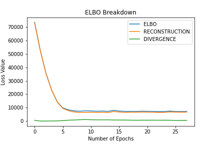
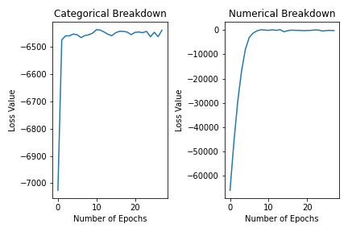

# Synthetic Data Exploration: Variational Autoencoders
## NHSX Analytics Unit - PhD Internship Project

### About the Project

[](https://github.com/GIScience/badges#experimental)

This repository holds code for the NHSX Analytics Unit PhD internship project (previously known as Synthetic Data Generation - VAE) contextualising and investigating the potential use of Variational AutoEncoders (VAEs) for synthetic health data generation initially undertaken by Dominic Danks ([last commit to the repository: commit 88a4bdf](https://github.com/nhsx/SynthVAE/commit/88a4bdf613f538af45834f22d38e52312cfe24c5)). This has then been further extended through the work undertaken by David Brind.

[Project Description - Synthetic Data Exploration: Variational Autoencoders](https://nhsx.github.io/nhsx-internship-projects/synthetic-data-exploration-vae/)

_**Note:** No data, public or private are shared in this repository._

### Project Stucture

- The main code is found in the root of the repository (see Usage below for more information)
- The accompanying [report](./reports/report.pdf) is also available in the `reports` folder
- More information about the VAE with Differential Privacy can be found in the [model card](./model_card.md)
- `scratch_vae_expts.py` is similar to the files you will find within the `investigations` folder. To re-run our results then `scratch_vae_expts.py` is all you require. If you want an easy way to understand our code and work process then using the respective notebooks within the `investigations` folder helps to run through the work.

### Getting Started

#### Installation

To get a local copy up and running follow these simple steps.

Clone the repo:

`git clone https://github.com/nhsx/SynthVAE.git`

Install the required version of Python (3.10) and follow the steps below to run the project:
1. Install [`poetry`](https://python-poetry.org/docs/)
2. Instantiate a virtual environment to install the package in: `python -m venv synthvae`
3. Activate the virtual environment: `source synthvae/bin/activate`
4. Install dependencies: `poetry install`

### Usage

There are three main sections of interest (2 folders and a collation of python files): `Hyperparameter_Tuning`, `Investigations` and files containing `sdv_baselines.py`, `scratch_vae_expts.py` and `plot.py`. `Hyperparameter_Tuning` and `Investigations` can use either SUPPORT or internal MIMIC datasets. `sdv_baselines.py`, `scratch_vae_expts.py` and `plot.py` all use SUPPORT only. If you want to run these quickly then below outlines command line implementation.

#### SDV Baselines

To reproduce the experiments contained in the report involving the [SDV](https://github.com/sdv-dev/SDV) baseline models (e.g. CopulaGAN, CTGAN, GaussianCopula and TVAE), run `sdv_baselines.py`. The parameters can be found using the `--help` flag:

```
python sdv_baselines.py --help

usage: sdv_baselines.py [-h] [--n_runs N_RUNS] [--model_type {CopulaGAN,CTGAN,GaussianCopula,TVAE}] [--pre_proc_method {GMM, standard}] [--save_metrics {True, False}] [--gower {True, False}]

optional arguments:
  -h, --help            show this help message and exit
  --n_runs N_RUNS       set number of runs/seeds
  --model_type          {CopulaGAN,CTGAN,GaussianCopula,TVAE}
                        set model for baseline experiment
  --pre_proc_method     {GMM, standard}
                        set the pre-processing method
  --save_metrics        {True, False}        
                        set if you wish to save the metrics for this model run - saves default as Metric Breakdown.csv unless changed
  --gower               {True, False}
                        calculate the average gower distance
```

#### Scratch VAE + Differential Privacy

To reproduce the experiments contained in the report involving the VAE with/without differential privacy, run `scratch_vae_expts.py`. The parameters can be found using the `--help` flag:

```
python scratch_vae_expts.py --help

usage: scratch_vae_expts.py [-h] [--n_runs N_RUNS] [--diff_priv DIFF_PRIV] [--n_epochs N_EPOCHS] [--save_file {True, False}] [--save_visualisation {True, False}] [--save_metrics {True, False}] [--pre_proc_method {GMM, standard}] [--gower {True, False}]

optional arguments:
  -h, --help            show this help message and exit
  --n_runs N_RUNS       set number of runs/seeds
  --diff_priv DIFF_PRIV
                        run VAE with differential privacy
  --n_epochs N_EPOCHS   number of epochs to train for (early stopping is used by default)
  --save_file           {True, False}
                        save trained model's state_dict as 'trained_SynthVAE.pt'
  --save_visualisation  {True, False}
                        save the loss & variable plots
  --save_metrics        {True, False}
                        calculate and save the metrics of the training set
  --pre_proc_method     {GMM, standard}
                        set the pre-processing method
  --gower               {True, False}
                        calculate the average gower distance
```

Code to load a saved model and generate correlation heatmaps is contained within `plot.py`.
The file containing the save model's `state_dict` should be provided via a command line argument:

```
python plot.py --help

usage: plot.py [-h] [--save_file SAVEFILE] [--pre_proc_method {GMM, standard}]

optional arguments:
  -h, --help           show this help message and exit
  --save_file SAVEFILE  load trained model's state_dict from file
  --pre_proc_method    {GMM, standard}
                       specify the pre-processing method that you wish to employ
```

#### Outputs Of The Model

There are a selection of plots & metrics the model can output. These are given by parse arguments `--save_metrics`, `--save_visualisation` or functions `plot_elbo`, `plot_likelihood_breakdown`, `plot_variable_distributions` & `distribution_metrics` in the notebooks provided. These outputs give you a graph displaying the ELBO breakdown during training, the breakdown of categorical & numerical likelihoods, a comparison of variable distributions between original data & synthetic data for each variable as well as a csv file displaying all the distributional metrics from SDV.

<figure>
  
  <figcaption><b>ELBO Breakdown</b></figcaption>
</figure>


<figure>
  
  <figcaption><b>Likelihood Breakdown</b></figcaption>
</figure>


<figure>
  
  <figcaption><b>Example Continuous Variable Comparison</b></figcaption>
</figure>


<figure>
  
  <figcaption><b>Example Discrete Variable Comparison</b></figcaption>
</figure>


The distributional metrics produces a csv following this order - depending on number of runs:

| SVCDetection | GMLogLikelihood | CSTest | KSTest | KSTestExtended | ContinuousKLDivergence | DiscreteKLDivergence |
| --- | --- | --- | --- | --- | --- | --- |
| 0.32 | -520.01 | 0.91 | 0.85 | 0.87 | 0.91 | 0.97 |
| 0.31 | -523.21 | 0.90 | 0.86 | 0.88 | 0.92 | 0.99 |

For information on these metrics then look in the [report](./reports/report.pdf) as well as the [SDV single table metrics documentation](https://sdv.dev/SDV/user_guides/evaluation/single_table_metrics.html)

#### Note On Reproducibility Of Results

In order to get reproducible results we have added in the `random_state` argument to the RDT transformers in order to set the sklearn's `random_state` argument. This results in the GMM pre-processing method producing the same transformation each run for the same dataset. We also set the PyTorch seed at the top of each file using the `set_seed` function found in utils. If you do not wish to nullify the randomness in training then remove this `set_seed` line at the start of the files.

#### Dataset

Experiments are run against the [Study to Understand Prognoses Preferences Outcomes and Risks of Treatment (SUPPORT) dataset](https://biostat.app.vumc.org/wiki/Main/SupportDesc) accessed via the [pycox](https://github.com/havakv/pycox) python library. Further experiments to test scalability of model were also performed on a pre-processed single table extracted from [MIMIC-III dataset](https://physionet.org/content/mimiciii/1.4/). The pre-processing to access this single table can be found within the [SynthVAE files](./MIMIC_preproc.ipynb).

Your dataset should follow a simple structure as shown in the [example table](./example_input.csv) - continuous, categorical & datetime variables with no missingness or NaN values. Number of columns can be as many as required along with as many rows as required.

### Roadmap

See the [open issues](https://github.com/nhsx/SynthVAE/issues) for a list of proposed features (and known issues).

### Contributing

Contributions are what make the open source community such an amazing place to learn, inspire, and create. Any contributions you make are **greatly appreciated**.

1. Fork the Project
2. Create your Feature Branch (`git checkout -b feature/AmazingFeature`)
3. Commit your Changes (`git commit -m 'Add some AmazingFeature'`)
4. Push to the Branch (`git push origin feature/AmazingFeature`)
5. Open a Pull Request

_See [CONTRIBUTING.md](./CONTRIBUTING.md) for detailed guidance._

### License

Distributed under the MIT License. _See [LICENSE](./LICENSE) for more information._

### Contact

To find out more about the [Analytics Unit](https://www.nhsx.nhs.uk/key-tools-and-info/nhsx-analytics-unit/) visit our [project website](https://nhsx.github.io/AnalyticsUnit/projects.html) or get in touch at [analytics-unit@nhsx.nhs.uk](mailto:analytics-unit@nhsx.nhs.uk).

<!-- ### Acknowledgements -->
